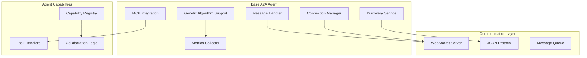
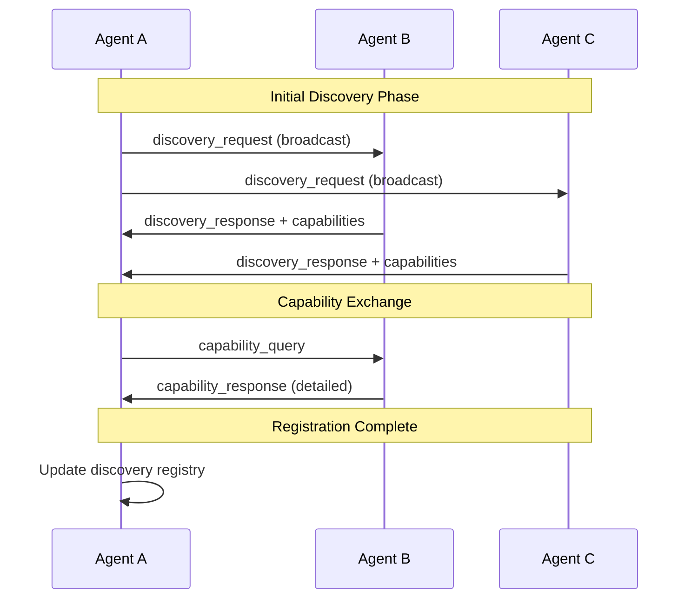
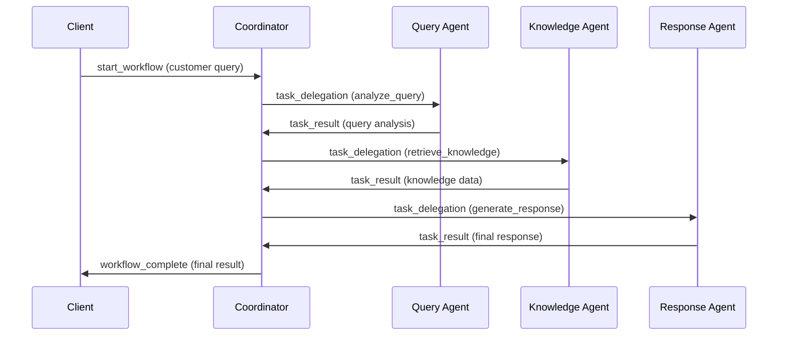
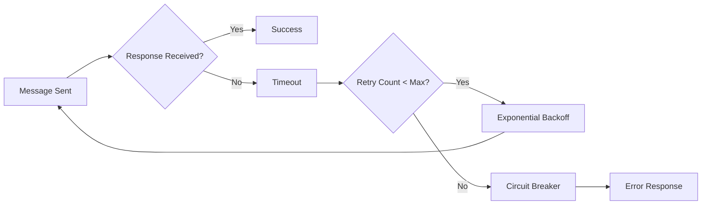
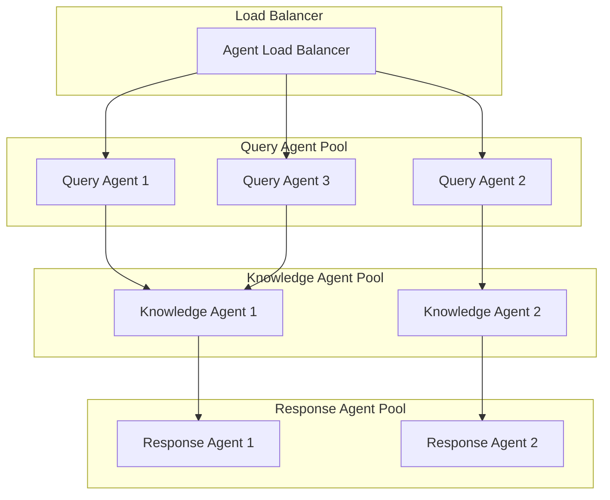

# A2A Protocol Architecture Guide

## System Architecture Overview

The A2A (Agent-to-Agent) Protocol implements a distributed, peer-to-peer communication system that enables AI agents to collaborate autonomously. The architecture is designed for scalability, fault tolerance, and evolutionary optimization.

## Core Components

### 1. Base Agent Framework



### 2. Communication Protocol Stack

| Layer | Purpose | Technology |
|-------|---------|------------|
| **Application Layer** | Agent logic and business rules | Python classes and methods |
| **Message Layer** | Structured message handling | JSON message format |
| **Transport Layer** | Real-time communication | WebSocket protocol |
| **Network Layer** | Network addressing and routing | TCP/IP |

## Message Flow Architecture

### 1. Discovery and Registration



### 2. Task Delegation Flow



### 3. Error Handling and Recovery



## Agent Types and Responsibilities

### 1. Query Agent Architecture

```python
class A2AQueryAgent:
    """
    Responsibilities:
    - Natural language understanding
    - Intent classification
    - Sentiment analysis
    - Query preprocessing
    """
    
    # Core capabilities
    capabilities = [
        'analyze_query',      # Main analysis function
        'classify_intent',    # Intent detection
        'extract_entities',   # Named entity recognition
        'detect_sentiment',   # Emotional analysis
        'assess_urgency',     # Priority assessment
        'language_detection'  # Multi-language support
    ]
    
    # Genetic parameters
    gene_template = {
        'confidence_threshold': 0.7,    # Minimum confidence for results
        'context_window_size': 1000,    # Context consideration size
        'include_sentiment': True,      # Whether to include sentiment
        'response_timeout': 30.0        # Max processing time
    }
```

### 2. Knowledge Agent Architecture

```python
class A2AKnowledgeAgent:
    """
    Responsibilities:
    - Multi-source information retrieval
    - Semantic search and ranking
    - Context synthesis
    - Knowledge base management
    """
    
    # Core capabilities
    capabilities = [
        'retrieve_knowledge',     # Main retrieval function
        'semantic_search',        # Vector-based search
        'rank_relevance',         # Result ranking
        'synthesize_context',     # Information combination
        'update_knowledge'        # Dynamic learning
    ]
    
    # Data sources
    data_sources = [
        'postgresql',    # Structured data
        'vector_db',     # Semantic embeddings
        'pdf_docs',      # Document repository
        'external_apis'  # Third-party sources
    ]
```

### 3. Response Agent Architecture

```python
class A2AResponseAgent:
    """
    Responsibilities:
    - Contextual response generation
    - Tone and style adaptation
    - Personalization
    - Multi-modal output
    """
    
    # Core capabilities
    capabilities = [
        'generate_response',      # Main generation function
        'adapt_tone',            # Tone customization
        'personalize_content',   # User-specific adaptation
        'format_output',         # Multi-format support
        'validate_response'      # Quality assurance
    ]
    
    # Output formats
    output_formats = [
        'text',          # Plain text response
        'markdown',      # Formatted text
        'html',          # Web-ready format
        'json',          # Structured data
        'rich_media'     # Including images/links
    ]
```

### 4. Coordinator Architecture

```python
class A2ACoordinator:
    """
    Responsibilities:
    - Workflow orchestration
    - Task routing and load balancing
    - Result aggregation
    - System health monitoring
    """
    
    # Core capabilities
    capabilities = [
        'workflow_orchestration',  # Main coordination function
        'agent_discovery',         # Service discovery
        'load_balancing',         # Task distribution
        'task_routing',           # Intelligent routing
        'result_aggregation'      # Result combination
    ]
    
    # Workflow patterns
    workflow_patterns = [
        'sequential',     # Step-by-step processing
        'parallel',       # Concurrent execution
        'conditional',    # Decision-based routing
        'pipeline',       # Streaming processing
        'fan_out_in'     # Broadcast and collect
    ]
```

## Scalability Patterns

### 1. Horizontal Scaling



### 2. Service Discovery Mechanism

```python
class ServiceDiscovery:
    """
    Manages agent registration and discovery
    """
    
    def __init__(self):
        self.registry = {
            'agents': {},           # Active agents
            'capabilities': {},     # Agent capabilities map
            'health_status': {},    # Health information
            'load_metrics': {}      # Performance metrics
        }
    
    async def register_agent(self, agent_info):
        """Register new agent"""
        agent_id = agent_info['agent_id']
        self.registry['agents'][agent_id] = {
            'info': agent_info,
            'last_seen': time.time(),
            'status': 'active'
        }
        
        # Update capability mapping
        for capability in agent_info.get('capabilities', []):
            if capability not in self.registry['capabilities']:
                self.registry['capabilities'][capability] = []
            self.registry['capabilities'][capability].append(agent_id)
    
    async def find_agents_by_capability(self, capability):
        """Find agents that provide specific capability"""
        return self.registry['capabilities'].get(capability, [])
    
    async def select_best_agent(self, capability, criteria='load'):
        """Select optimal agent based on criteria"""
        candidates = await self.find_agents_by_capability(capability)
        
        if criteria == 'load':
            # Select agent with lowest load
            return min(candidates, key=lambda x: self.get_load_metric(x))
        elif criteria == 'response_time':
            # Select agent with best response time
            return min(candidates, key=lambda x: self.get_response_time(x))
        
        return candidates[0] if candidates else None
```

## Fault Tolerance and Recovery

### 1. Circuit Breaker Pattern

```python
class CircuitBreaker:
    """
    Implements circuit breaker pattern for agent communication
    """
    
    def __init__(self, failure_threshold=5, timeout=60):
        self.failure_threshold = failure_threshold
        self.timeout = timeout
        self.failure_count = 0
        self.last_failure_time = 0
        self.state = 'CLOSED'  # CLOSED, OPEN, HALF_OPEN
    
    async def call(self, func, *args, **kwargs):
        """Execute function with circuit breaker protection"""
        
        if self.state == 'OPEN':
            if time.time() - self.last_failure_time > self.timeout:
                self.state = 'HALF_OPEN'
            else:
                raise CircuitBreakerOpenException()
        
        try:
            result = await func(*args, **kwargs)
            self._on_success()
            return result
            
        except Exception as e:
            self._on_failure()
            raise e
    
    def _on_success(self):
        """Handle successful call"""
        self.failure_count = 0
        self.state = 'CLOSED'
    
    def _on_failure(self):
        """Handle failed call"""
        self.failure_count += 1
        self.last_failure_time = time.time()
        
        if self.failure_count >= self.failure_threshold:
            self.state = 'OPEN'
```

### 2. Health Monitoring

```python
class HealthMonitor:
    """
    Monitors agent health and system status
    """
    
    async def check_agent_health(self, agent_id):
        """Comprehensive health check"""
        health_status = {
            'agent_id': agent_id,
            'timestamp': time.time(),
            'status': 'healthy',
            'metrics': {}
        }
        
        try:
            # Check connectivity
            ping_success = await self.ping_agent(agent_id)
            health_status['metrics']['connectivity'] = ping_success
            
            # Check resource usage
            resources = await self.get_resource_usage(agent_id)
            health_status['metrics']['resources'] = resources
            
            # Check performance metrics
            performance = await self.get_performance_metrics(agent_id)
            health_status['metrics']['performance'] = performance
            
            # Determine overall health
            if not ping_success:
                health_status['status'] = 'unreachable'
            elif resources.get('cpu_percent', 0) > 90:
                health_status['status'] = 'overloaded'
            elif performance.get('avg_response_time', 0) > 10:
                health_status['status'] = 'slow'
            
        except Exception as e:
            health_status['status'] = 'error'
            health_status['error'] = str(e)
        
        return health_status
```

## Performance Optimization

### 1. Message Batching

```python
class MessageBatcher:
    """
    Batches messages for improved throughput
    """
    
    def __init__(self, batch_size=10, timeout=1.0):
        self.batch_size = batch_size
        self.timeout = timeout
        self.pending_messages = []
        self.last_batch_time = time.time()
    
    async def add_message(self, message):
        """Add message to batch"""
        self.pending_messages.append(message)
        
        # Send batch if conditions met
        if (len(self.pending_messages) >= self.batch_size or 
            time.time() - self.last_batch_time > self.timeout):
            await self.send_batch()
    
    async def send_batch(self):
        """Send accumulated messages as batch"""
        if not self.pending_messages:
            return
        
        batch_message = {
            'message_type': 'batch',
            'messages': self.pending_messages,
            'batch_size': len(self.pending_messages)
        }
        
        await self.send_message(batch_message)
        
        self.pending_messages.clear()
        self.last_batch_time = time.time()
```

### 2. Connection Pooling

```python
class ConnectionPool:
    """
    Manages WebSocket connection pool for agents
    """
    
    def __init__(self, max_connections=100):
        self.max_connections = max_connections
        self.active_connections = {}
        self.connection_stats = {}
    
    async def get_connection(self, agent_id):
        """Get or create connection to agent"""
        if agent_id in self.active_connections:
            connection = self.active_connections[agent_id]
            if connection.open:
                return connection
            else:
                # Remove stale connection
                del self.active_connections[agent_id]
        
        # Create new connection
        if len(self.active_connections) < self.max_connections:
            connection = await self.create_connection(agent_id)
            self.active_connections[agent_id] = connection
            return connection
        else:
            # Pool is full, use least recently used connection
            lru_agent = min(self.connection_stats.keys(), 
                          key=lambda x: self.connection_stats[x]['last_used'])
            await self.close_connection(lru_agent)
            
            connection = await self.create_connection(agent_id)
            self.active_connections[agent_id] = connection
            return connection
```

## Security Considerations

### 1. Authentication and Authorization

```python
class A2ASecurityManager:
    """
    Handles security for A2A communications
    """
    
    def __init__(self):
        self.agent_credentials = {}
        self.permissions = {}
        self.token_store = {}
    
    async def authenticate_agent(self, agent_id, credentials):
        """Authenticate agent identity"""
        stored_creds = self.agent_credentials.get(agent_id)
        if not stored_creds:
            raise AuthenticationError(f"Unknown agent: {agent_id}")
        
        # Verify credentials (simplified)
        if credentials != stored_creds:
            raise AuthenticationError("Invalid credentials")
        
        # Generate session token
        token = self.generate_token(agent_id)
        self.token_store[token] = {
            'agent_id': agent_id,
            'issued_at': time.time(),
            'expires_at': time.time() + 3600  # 1 hour
        }
        
        return token
    
    async def authorize_message(self, sender_id, message_type, target_id):
        """Check if agent is authorized for operation"""
        permissions = self.permissions.get(sender_id, [])
        
        required_permission = f"{message_type}:{target_id}"
        if required_permission not in permissions:
            raise AuthorizationError(f"Insufficient permissions: {required_permission}")
        
        return True
```

This architecture guide provides the foundation for understanding and extending the A2A protocol system. Each component is designed to be modular, scalable, and maintainable while supporting the evolutionary optimization capabilities of the genetic algorithm framework.
