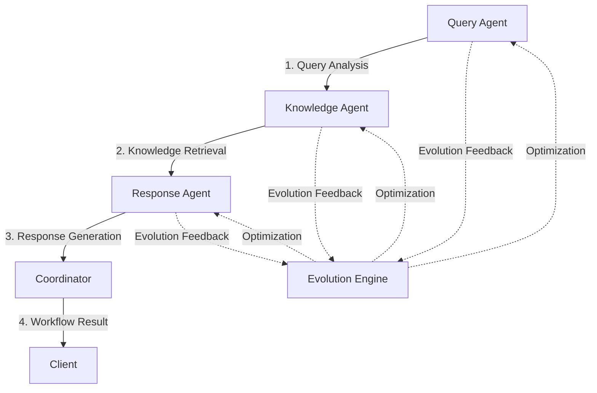

# Agent-to-Agent (A2A) Protocol Documentation

## 📋 Table of Contents

1. [Overview](#overview)
2. [Quick Start Guide](#quick-start-guide)
3. [Protocol Architecture](#protocol-architecture)
4. [Message Format](#message-format)
5. [Agent Types](#agent-types)
6. [Communication Patterns](#communication-patterns)
7. [Code Examples](#code-examples)
8. [Best Practices](#best-practices)
9. [Troubleshooting](#troubleshooting)

## Overview

The **Agent-to-Agent (A2A) Protocol** is a lightweight, scalable communication framework that enables autonomous AI agents to collaborate effectively in distributed environments. It provides a standardized way for agents to discover each other, exchange capabilities, delegate tasks, and coordinate complex workflows.

### Key Features

- 🔗 **Decoupled Communication**: Agents communicate independently without central coordination
- 🚀 **Real-time Messaging**: WebSocket-based protocol for instant communication
- 🔍 **Auto-Discovery**: Agents automatically discover and register with each other
- 📊 **Built-in Metrics**: Performance tracking and collaboration analytics
- 🧬 **Genetic Integration**: Seamless integration with genetic algorithm optimization
- 🔌 **MCP Support**: Model Context Protocol integration for external services

### Why A2A Protocol?

- **Scalability**: Agents can be deployed and scaled independently
- **Fault Tolerance**: System continues operating even if individual agents fail
- **Flexibility**: Easy to add new agent types and capabilities
- **Performance**: Direct peer-to-peer communication reduces latency
- **Evolution**: Agents can optimize their collaboration strategies over time

## Quick Start Guide

### 1. Basic Agent Setup

```python
from src.a2a_protocol.base_a2a_agent import A2AAgent

# Create a simple agent
agent = A2AAgent(agent_id="my_agent", agent_type="custom", port=8005)

# Start the agent
await agent.start()
```

### 2. Send a Message

```python
# Send a message to another agent
await agent.send_message(
    receiver_id="target_agent",
    message_type="task_request",
    payload={"task": "process_data", "data": {...}}
)
```

### 3. Handle Incoming Messages

```python
# Register a custom message handler
async def handle_custom_message(message):
    print(f"Received: {message.payload}")
    
agent.message_handlers["custom_type"] = handle_custom_message
```

### 4. Discover Other Agents

```python
# Discover available agents
await agent.discover_agents()

# Check discovered agents
print(agent.discovery_registry)
```

## Protocol Architecture

### Communication Flow



### Network Topology

- **Mesh Network**: All agents can communicate directly with each other
- **Service Discovery**: Agents automatically register and discover capabilities
- **Load Balancing**: Coordinator distributes tasks based on agent availability
- **Fault Recovery**: Automatic reconnection and task redistribution

## Message Format

### Standard Message Structure

```json
{
  "message_id": "uuid-string",
  "sender_id": "agent_identifier",
  "receiver_id": "target_agent_identifier",
  "message_type": "message_category",
  "payload": {
    "key": "value",
    "data": "..."
  },
  "request_id": "correlation_id",
  "timestamp": "ISO-8601-datetime"
}
```

### Message Types

| Type | Purpose | Direction |
|------|---------|-----------|
| `discovery_request` | Find available agents | Broadcast |
| `discovery_response` | Announce capabilities | Response |
| `capability_query` | Query agent abilities | Request |
| `capability_response` | Return capabilities list | Response |
| `collaboration_request` | Request task collaboration | Request |
| `collaboration_response` | Accept/decline collaboration | Response |
| `task_delegation` | Delegate specific task | Request |
| `task_result` | Return task completion | Response |
| `error` | Report error condition | Response |

## Agent Types

### 1. Query Agent (`a2a_query_agent`)

**Purpose**: Analyzes and preprocesses customer queries

**Capabilities**:
- Natural language understanding
- Intent classification
- Sentiment analysis
- Urgency detection
- Entity extraction

**Port**: 8001

**Example Usage**:
```python
from src.a2a_protocol.a2a_query_agent import A2AQueryAgent

agent = A2AQueryAgent(
    agent_id="query_001",
    api_key="your-llm-api-key",
    llm_provider="openai"
)
await agent.start()
```

### 2. Knowledge Agent (`a2a_knowledge_agent`)

**Purpose**: Retrieves and synthesizes relevant information

**Capabilities**:
- Multi-source information retrieval
- Semantic search
- Context synthesis
- Relevance scoring

**Port**: 8002

**Example Usage**:
```python
from src.a2a_protocol.a2a_knowledge_agent import A2AKnowledgeAgent

agent = A2AKnowledgeAgent(
    agent_id="knowledge_001",
    api_key="your-llm-api-key"
)
await agent.start()
```

### 3. Response Agent (`a2a_response_agent`)

**Purpose**: Generates contextual customer responses

**Capabilities**:
- Response generation
- Tone adaptation
- Personalization
- Multi-modal output

**Port**: 8003

**Example Usage**:
```python
from src.a2a_protocol.a2a_response_agent import A2AResponseAgent

agent = A2AResponseAgent(
    agent_id="response_001",
    api_key="your-llm-api-key"
)
await agent.start()
```

### 4. Coordinator Agent (`a2a_coordinator`)

**Purpose**: Orchestrates multi-agent workflows

**Capabilities**:
- Workflow orchestration
- Task routing
- Load balancing
- Result aggregation

**Port**: 8004

**Example Usage**:
```python
from src.a2a_protocol.a2a_coordinator import A2ACoordinator

coordinator = A2ACoordinator(agent_id="coordinator_001")
await coordinator.start()
```

## Communication Patterns

### 1. Request-Response Pattern

```python
# Agent A sends request
await agent_a.send_message(
    receiver_id="agent_b",
    message_type="task_request",
    payload={"task": "analyze", "data": "..."}
)

# Agent B processes and responds
async def handle_task_request(message):
    result = process_task(message.payload)
    await agent_b.send_message(
        receiver_id=message.sender_id,
        message_type="task_result",
        payload={"result": result},
        request_id=message.request_id
    )
```

### 2. Workflow Orchestration

```python
# Coordinator orchestrates multi-step workflow
async def orchestrate_workflow(self, workflow_data):
    # Step 1: Query analysis
    query_result = await self.delegate_task("query_agent", {
        "task": "analyze_query",
        "query": workflow_data["query"]
    })
    
    # Step 2: Knowledge retrieval
    knowledge_result = await self.delegate_task("knowledge_agent", {
        "task": "retrieve_knowledge",
        "query_analysis": query_result
    })
    
    # Step 3: Response generation
    response_result = await self.delegate_task("response_agent", {
        "task": "generate_response",
        "query_analysis": query_result,
        "knowledge": knowledge_result
    })
    
    return response_result
```

### 3. Broadcast Communication

```python
# Broadcast health check to all agents
await coordinator.broadcast_message(
    message_type="health_check",
    payload={"timestamp": datetime.now().isoformat()}
)
```

## Code Examples

### Complete Workflow Example

```python
import asyncio
from src.a2a_protocol.a2a_coordinator import A2ACoordinator
from src.a2a_protocol.a2a_query_agent import A2AQueryAgent
from src.a2a_protocol.a2a_knowledge_agent import A2AKnowledgeAgent
from src.a2a_protocol.a2a_response_agent import A2AResponseAgent

async def run_customer_support_workflow():
    # Initialize agents
    coordinator = A2ACoordinator()
    query_agent = A2AQueryAgent(api_key="your-api-key")
    knowledge_agent = A2AKnowledgeAgent(api_key="your-api-key")
    response_agent = A2AResponseAgent(api_key="your-api-key")
    
    # Start all agents
    await coordinator.start()
    await query_agent.start()
    await knowledge_agent.start()
    await response_agent.start()
    
    # Wait for discovery
    await asyncio.sleep(2)
    
    # Process customer query
    result = await coordinator.process_task({
        "task_type": "customer_support_workflow",
        "query_data": {
            "query": "I can't log into my account",
            "customer_id": "12345",
            "api_key": "your-api-key"
        }
    })
    
    print(f"Workflow result: {result}")
    
    # Cleanup
    await coordinator.stop()
    await query_agent.stop()
    await knowledge_agent.stop()
    await response_agent.stop()

# Run the workflow
asyncio.run(run_customer_support_workflow())
```

### Custom Agent Example

```python
from src.a2a_protocol.base_a2a_agent import A2AAgent

class CustomAnalyticsAgent(A2AAgent):
    def __init__(self, agent_id: str = "analytics_agent"):
        super().__init__(agent_id, "analytics", 8005)
        
        # Register custom message handlers
        self.message_handlers.update({
            'analyze_metrics': self._handle_metrics_analysis,
            'generate_report': self._handle_report_generation
        })
    
    def get_capabilities(self) -> List[str]:
        return ['metrics_analysis', 'report_generation', 'data_visualization']
    
    async def _handle_metrics_analysis(self, message):
        # Process metrics data
        metrics_data = message.payload.get('metrics', {})
        analysis_result = self.analyze_metrics(metrics_data)
        
        # Send response
        await self.send_message(
            receiver_id=message.sender_id,
            message_type="analysis_result",
            payload={"analysis": analysis_result},
            request_id=message.request_id
        )
    
    def analyze_metrics(self, metrics_data):
        # Custom analytics logic
        return {
            "summary": "Metrics analysis complete",
            "insights": ["Performance improved by 15%", "Error rate decreased"],
            "recommendations": ["Scale up during peak hours"]
        }

# Usage
analytics_agent = CustomAnalyticsAgent()
await analytics_agent.start()
```

## Best Practices

### 1. Error Handling

```python
async def robust_message_handler(self, message):
    try:
        result = await self.process_complex_task(message.payload)
        await self.send_message(
            receiver_id=message.sender_id,
            message_type="task_result",
            payload={"result": result},
            request_id=message.request_id
        )
    except Exception as e:
        await self.send_error_response(message, str(e))
```

### 2. Message Validation

```python
def validate_message_payload(self, message, required_fields):
    payload = message.payload
    missing_fields = [field for field in required_fields if field not in payload]
    
    if missing_fields:
        raise ValueError(f"Missing required fields: {missing_fields}")
    
    return True
```

### 3. Timeout Handling

```python
async def send_message_with_timeout(self, receiver_id, message_type, payload, timeout=30):
    try:
        response = await asyncio.wait_for(
            self.send_message(receiver_id, message_type, payload),
            timeout=timeout
        )
        return response
    except asyncio.TimeoutError:
        self.logger.warning(f"Message to {receiver_id} timed out")
        return None
```

### 4. Resource Management

```python
async def cleanup_agent(self):
    # Close connections
    for ws in self.connections.values():
        await ws.close()
    
    # Clear handlers
    self.message_handlers.clear()
    
    # Reset metrics
    self.metrics = {
        'messages_sent': 0,
        'messages_received': 0
    }
```

## Troubleshooting

### Common Issues

#### 1. Connection Refused
**Problem**: Agent cannot connect to another agent
**Solution**: 
- Check if target agent is running
- Verify port numbers are correct
- Check firewall settings

#### 2. Message Handler Not Found
**Problem**: Receiving "No handler for message type" warnings
**Solution**:
```python
# Register missing handler
self.message_handlers["custom_type"] = self._handle_custom_message
```

#### 3. Discovery Timeout
**Problem**: Agents not discovering each other
**Solution**:
- Increase discovery timeout
- Check network connectivity
- Verify agent IDs are unique

#### 4. Memory Leaks
**Problem**: Memory usage increases over time
**Solution**:
- Implement connection cleanup
- Clear message queues periodically
- Monitor connection count

### Debug Commands

```python
# Check agent status
print(f"Agent running: {agent.running}")
print(f"Connections: {list(agent.connections.keys())}")
print(f"Metrics: {agent.metrics}")

# Test connectivity
await agent.send_message("test_agent", "ping", {})

# Check discovery registry
print(f"Known agents: {agent.discovery_registry}")
```

### Performance Monitoring

```python
# Monitor message throughput
def log_performance_metrics(self):
    total_messages = self.metrics['messages_sent'] + self.metrics['messages_received']
    success_rate = self.metrics['successful_collaborations'] / max(1, total_messages)
    
    self.logger.info(f"Messages: {total_messages}, Success rate: {success_rate:.2%}")
```

---

## Additional Resources

- [Base Agent Implementation](../src/a2a_protocol/base_a2a_agent.py)
- [Agent Examples](../examples/a2a_usage_example.py)
- [MCP Integration Guide](../mcp/README.md)
- [Genetic Algorithm Integration](../docs/geneticML/README.md)

For questions or support, please refer to the main project documentation or contact the development team.
