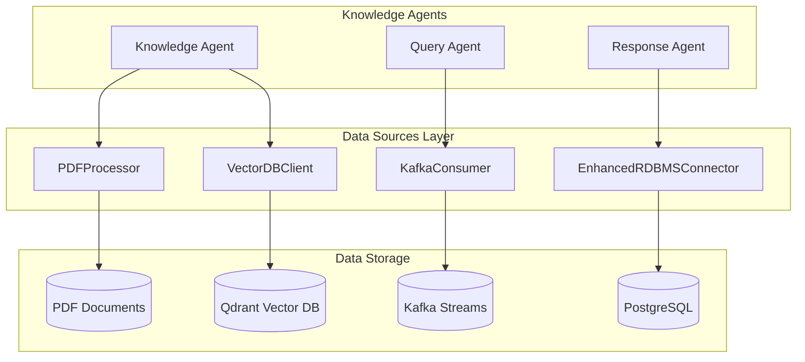

# Data Sources Package

This package provides data source abstraction layers for the Agentic AI Customer Support system.

## Overview

The `data_sources` package contains specialized clients and processors for various data storage and streaming systems. These components serve as the foundation for the knowledge base, real-time processing, and document management capabilities.

## Components

### 🔍 PDFProcessor (`pdf_processor.py`)
**Purpose**: Intelligent PDF document processing and search
- **Features**: 
  - Text extraction from PDF documents
  - TF-IDF based content search
  - Document chunking for better retrieval
  - Summary generation and metadata extraction
- **Usage**: Knowledge base content from PDF manuals, policies, and documentation

### 🔮 VectorDBClient (`vector_db_client.py`)
**Purpose**: Semantic search using Qdrant vector database
- **Features**:
  - Embedding generation using sentence transformers
  - Vector similarity search
  - Collection management and indexing
  - Async operation support
- **Usage**: Semantic knowledge retrieval and contextual search

### 📡 KafkaConsumer (`kafka_consumer.py`)
**Purpose**: Real-time event stream processing
- **Features**:
  - Message consumption from Kafka topics
  - Event-driven customer support workflows
  - Message handlers for different event types
  - Producer capabilities for response events
- **Usage**: Real-time query processing and system event handling

### 🗄️ EnhancedRDBMSConnector (`rdbms_connector.py`)
**Purpose**: Comprehensive PostgreSQL database operations
- **Features**:
  - Full customer support schema operations
  - Advanced analytics and reporting queries
  - Performance metrics tracking
  - AI interaction logging
- **Usage**: Core data persistence and analytics

## Architecture



## Usage Examples

### PDF Processing
```python
from src.data_sources import PDFProcessor

processor = PDFProcessor()
await processor.initialize()

# Search documents
results = await processor.search_documents("API authentication")
```

### Vector Search
```python
from src.data_sources import VectorDBClient

client = VectorDBClient(config)
await client.connect()

# Semantic search
results = await client.search("customer billing issues")
```

### Kafka Event Processing
```python
from src.data_sources import KafkaConsumer

consumer = KafkaConsumer(config)
await consumer.start()

# Process real-time events
await consumer.register_handler("customer_query", query_handler)
```

### Database Operations
```python
from src.data_sources import EnhancedRDBMSConnector

db = EnhancedRDBMSConnector()
await db.connect()

# Customer operations
customers = await db.get_customers(limit=100)
analytics = await db.get_system_analytics()
```

## Migration Notes

### Removed Components (v2.0 Cleanup)
- ❌ `mcp_client.py` - Moved to `src.mcp.postgres_mcp_client`
- ❌ `mcp_client_deprecated.py` - Removed (deprecated)
- ❌ `postgresql_client.py` - Functionality merged into `rdbms_connector.py`

### Updated Import Paths
```python
# OLD (removed)
# from src.data_sources.mcp_client import PostgreSQLMCPClient

# NEW
from src.mcp.postgres_mcp_client import OptimizedPostgreSQLMCPClient
```

## Configuration

Each component requires specific configuration parameters:

### Vector Database
```python
vector_config = {
    'host': 'localhost',
    'port': 6333,
    'collection_name': 'customer_support'
}
```

### Kafka
```python
kafka_config = {
    'bootstrap_servers': ['localhost:9092'],
    'topics': ['customer_queries', 'agent_responses'],
    'group_id': 'support_system'
}
```

### Database
```python
db_config = {
    'host': 'localhost',
    'port': 5432,
    'database': 'customer_support',
    'user': 'support_user',
    'password': 'password'
}
```

## Testing

All components have comprehensive test coverage:
- Unit tests: `tests/data_sources/`
- Integration tests: `tests/integration/`
- Performance tests: `tests/performance/`

## Dependencies

Core dependencies for each component:
- **PDFProcessor**: `PyPDF2`, `scikit-learn`
- **VectorDBClient**: `qdrant-client`, `sentence-transformers`
- **KafkaConsumer**: `kafka-python`
- **RDBMSConnector**: `psycopg2-binary`

## Contributing

When adding new data sources:
1. Implement async operations where possible
2. Include comprehensive error handling
3. Add logging for debugging and monitoring
4. Write unit and integration tests
5. Update this documentation

## See Also

- [MCP Integration Guide](../../docs/API_MCP_Integration.md)
- [Database Schema](../../ops/postgres/init-scripts/)
- [Configuration Management](../../config/README.md)
